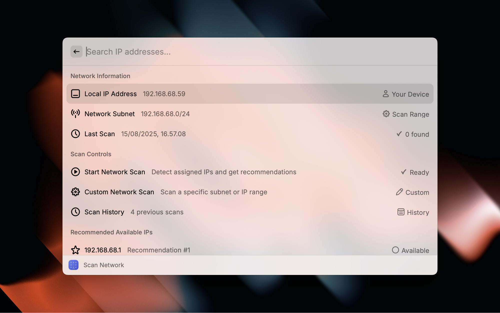

# IP Finder - Network Scanner

A powerful Raycast extension to scan your local network, detect assigned IP addresses, and get smart recommendations for available addresses to prevent IP conflicts.



## Features


- **🔍 Network Discovery**: Automatically detect your local network and scan for assigned IPs
- **📊 IP Recommendations**: Get intelligent recommendations for available IP addresses
- **🎯 Custom Scanning**: Scan specific subnets or IP ranges with CIDR notation
- **⚡ Fast Performance**: Concurrent scanning with configurable thread limits
- **🖥️ Cross-Platform**: Works seamlessly on macOS, Windows, and Linux
- **📱 Device Information**: Gather MAC addresses, hostnames, and manufacturer details
- **🔌 Port Scanning**: Detect open ports with service identification
- **📈 Scan History**: Keep track of previous scans and results
- **📋 Export Results**: Copy IP lists or export detailed reports

## Quick Start


## Commands

### Scan Network
The main command that provides a comprehensive interface for network scanning:
- View your local IP and subnet information
- Start automatic network scanning
- Configure custom scan parameters
- View assigned and recommended IPs
- Export results and manage scan history

## Installation

1. Install the extension from the Raycast Store
2. The extension will automatically detect your network configuration
3. No additional setup required - just start scanning!

## Usage

### Basic Network Scan
1. Open Raycast and search for "Scan Network"
2. Click "Start Network Scan" to begin automatic scanning
3. View results showing assigned IPs and recommendations

### Custom Subnet Scan
1. Use "Custom Network Scan" to specify a different subnet
2. Enter subnet in CIDR notation (e.g., `192.168.1.0/24`)
3. Configure timeout and thread settings
4. Start the scan and view results

### Device Information
- View MAC addresses, hostnames, and manufacturer details
- See open ports with service names (HTTP, SSH, etc.)
- Copy device information to clipboard
- Open devices in browser

## Configuration

The extension includes several preferences you can configure:

- **Default Timeout**: Ping timeout in seconds (default: 1.0)
- **Default Max Threads**: Maximum concurrent ping attempts (default: 50)
- **Default Recommendations**: Number of IP recommendations (default: 10)
- **Auto-scan on Open**: Automatically start scanning when opening
- **Show Progress Bar**: Display scanning progress
- **Scan Common Ranges**: Focus on common IP ranges for faster scanning
- **Gather Device Information**: Get MAC addresses and device details
- **Scan Open Ports**: Check for open ports on discovered devices

## Common Use Cases

- **Network Administration**: Quickly identify all devices on your network
- **IP Conflict Prevention**: Find available IPs before assigning static addresses
- **Network Troubleshooting**: Detect connectivity issues and missing devices
- **Home Network Management**: Keep track of connected devices
- **Network Security**: Identify unknown devices and open ports

## Examples

### Common Subnets
- `192.168.1.0/24` - Typical home network
- `10.0.0.0/16` - Large corporate network
- `172.16.0.0/12` - Private network range

### Sample Results
```
Assigned IPs:
- 192.168.1.1 (Router) - MAC: AA:BB:CC:DD:EE:FF
- 192.168.1.5 (Your Device) - MAC: 11:22:33:44:55:66
- 192.168.1.10 (Printer) - Ports: 80 (HTTP), 631 (IPP)

Recommended Available IPs:
- 192.168.1.2
- 192.168.1.3
- 192.168.1.4
```

## Privacy & Security

- **Local Operation**: All scanning is performed locally on your machine
- **No External Calls**: No network data is sent to external servers
- **Secure Storage**: Scan history is stored locally using Raycast's secure storage
- **Standard Commands**: Uses standard ping commands with no elevated privileges required
- **No Keychain Access**: Does not require or request keychain access

## Technical Details

This extension is built with:
- **TypeScript** and **React** for robust development
- **Raycast API** for seamless integration
- **Node.js child_process** for cross-platform ping commands
- **LocalStorage** for secure data persistence
- **Concurrent scanning** with configurable thread limits

## Support

If you encounter any issues or have questions:
1. Check that your network allows ICMP ping packets
2. Ensure you have proper network permissions
3. Try adjusting timeout and thread settings for your network
4. Verify your firewall settings allow local network communication

## Development

This extension is open source and contributions are welcome. The codebase follows Raycast development guidelines and best practices.

---

**Note**: This extension requires network access to perform scanning operations. Make sure your network configuration allows ICMP ping packets for optimal functionality. 